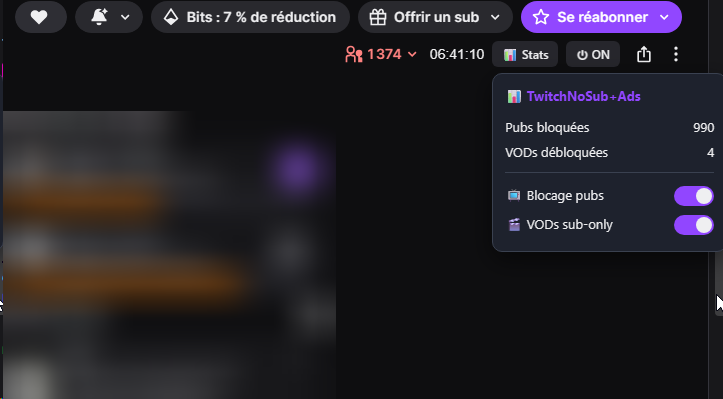

# TwVodNoAdsJCed

 

Userscript Tampermonkey qui **bloque les pubs Twitch**, **débloque les VODs sub-only** et **dé-mute les VODs**.

Basé sur [pixeltris/TwitchAdSolutions](https://github.com/pixeltris/TwitchAdSolutions) (script `vaft`) et sur la méthode de bypass VOD de [besuper/TwitchNoSub](https://github.com/besuper/TwitchNoSub).

## ✨ Fonctionnalités

- **Blocage des pubs** — hook du Worker Twitch (méthode vaft) : récupère un stream propre, supprime les segments pub si nécessaire, corrige le buffering
- **VODs sub-only** — bypass usher : quand `usher.ttvnw.net/vod/` renvoie un **403** (VOD réservée aux abonnés), le script construit un playlist CDN direct à partir des métadonnées GQL (`seekPreviewsURL`) → la vidéo se lance
- **Dé-mute des VODs** — réécriture `-unmuted` → `-muted` dans les playlists cloudfront (récupère les segments avec le son d'origine)
- **Boutons dans le header Twitch** — `📊 Stats` (toast avec les compteurs) et `⏻ ON/OFF` (activation/désactivation du script)
- **Stats en console** — compteurs persistants (localStorage) : pubs bloquées / VODs débloquées

## 📦 Installation — guide pas à pas

### 1. Installer Tampermonkey (si besoin)
- [Tampermonkey pour Chrome](https://chromewebstore.google.com/detail/dhdgffkkebhmkfjojejmpbldmpobfkfo) · [pour Firefox](https://addons.mozilla.org/fr/firefox/addon/tampermonkey/)
- ⚠️ **Chrome / Manifest V3 uniquement** : allez dans `chrome://extensions` → **Détails** de Tampermonkey → activez **« Autoriser les scripts utilisateur »** (Allow user scripts). Sans cette option, le script ne s'exécute jamais.

### 2. Installer le script
- Cliquez sur le **badge violet « Install with Tampermonkey »** en haut de ce README, ou ouvrez directement :
  <https://raw.githubusercontent.com/Endymi0n74/TwVodNoAdsJCed/master/combined/twitch-combined.user.js>
- Tampermonkey affiche la page d'installation → cliquez sur **« Installer »**

### 3. Vérifier que ça marche
- Allez sur **twitch.tv** (n'importe quelle chaîne) et ouvrez la console (**F12**)
- Vous devez voir : `hookWorkerFetch (vaft)` puis le résumé `📊 TwitchNoSub+Ads` avec vos compteurs
- Le bouton **📊 Stats** apparaît à gauche de la barre viewers/durée du header

### 4. Mettre à jour
- **Automatique** : le script se met à jour tout seul (via `@updateURL`, contrôle périodique de Tampermonkey)
- **Manuel** : tableau de bord Tampermonkey → script → **Mettre à jour** (ou réinstaller depuis l'URL ci-dessus)
- Vérifiez la version affichée (badge version du README / `@version` dans le script) — voir [CHANGELOG.md](CHANGELOG.md)

### 5. Désactiver / désinstaller
- **Désactiver temporairement** : bouton **⏻ OFF** dans le header (recharge la page, le bouton reste accessible pour réactiver)
- **Désinstaller** : tableau de bord Tampermonkey → corbeille sur le script

## 🚀 Utilisation

- Sur une chaîne Twitch, deux boutons apparaissent **à gauche de la barre viewers/durée** du header :
  - **📊 Stats** — ouvre le **panneau déroulant** : compteurs + toggles (voir capture ci-dessus)
  - **⏻ ON/OFF** — désactive/réactive **tout** le script (recharge la page ; le bouton reste accessible en OFF)
- **Le panneau** :
  - `📺 Blocage pubs` — **ON** : bloque les pubs live (stream propre). **OFF** : les pubs repassent normalement
  - `🎬 VODs sub-only` — **ON** : débloque les VODs réservées aux abonnés (+ dé-mute les VODs mutées). **OFF** : le paywall Twitch reste affiché
  - Les toggles s'appliquent **immédiatement** (le player se recharge, ou la page si besoin) — aucun rechargement manuel
  - ⚠️ Les **clips et VODs publiques** jouent toujours, quel que soit le toggle VODs (rien à débloquer — normal)
- **Console (F12)** : résumé des stats au chargement, puis un log à chaque pub bloquée (`📺 Pub bloquée`) et à chaque VOD débloquée (`🎬 VOD sub-only débloquée`)

## ⚠️ Attention

- **Ne pas combiner avec d'autres bloqueurs de pubs Twitch** (vaft, TTV LOL PRO, TwitchNoSub, Purple AdBlock…) — les scripts se marchent dessus (double hook des Workers).
- Testé sur Chrome + Tampermonkey.

## 🏗️ Architecture

`combined/twitch-combined.user.js` — script unique (~1 500 lignes), dérivé de vaft :

| Bloc | Rôle |
|------|------|
| `hookWindowWorker()` | Intercepte le Worker blob de Twitch et y injecte le hook fetch |
| `hookWorkerFetch()` | Dans le worker : m3u8 (pubs), `channel/hls` (encodings live), `usher.ttvnw.net/vod/` (VODs) |
| `buildVodPlaylist()` | Bypass usher 403 → playlist CDN direct (qualités vérifiées, codec détecté) |
| `-unmuted → -muted` | Dé-mute les playlists cloudfront |
| `removeRestrictions()` | Nettoyage d'overlays résiduels (sélecteurs historiques) |
| Boutons header + panneau | Boutons 📊 Stats / ⏻ ON-OFF + panneau déroulant (stats + toggles pubs/VODs) + logs console |

## 📂 Contenu du repo

- `combined/twitch-combined.user.js` — **le script** (à installer)
- `combined/test-buildVodPlaylist.js` — harness de test Node du bypass VOD (mock fetch/GQL, 3 branches, format playlist) — `node combined/test-buildVodPlaylist.js`
- `docs/panel.png` — capture d'écran du panneau pour le README
- `.github/workflows/` — **CI** : `node --check` + harness sur chaque push, et release automatique sur tag `v*` (script en pièce jointe)
- `vaft/`, `video-swap-new/` — scripts upstream d'origine (le combiné en dérive)
- `MEMORY.md` — mémoire de développement (règles, bugs connus, backlog)
- `CHANGELOG.md` — historique des versions
- `issues.md` — problèmes connus de la base vaft / video-swap-new
- `LICENSE` — MIT

## ❓ FAQ — erreurs courantes & conflits

### Comment vérifier la version installée ?
- Tampermonkey → tableau de bord : la colonne « Version » affiche la version installée (ex. `1.1.3`).
- Comparez avec le badge version du README ou la dernière entrée du [CHANGELOG](CHANGELOG.md). Si une version plus récente existe : **Mettre à jour** (ou réinstaller depuis l'URL d'installation).

### Le script ne fait rien
- Vérifiez dans la console (F12) la présence de `hookWorkerFetch (vaft)` après un refresh. S'il n'y a pas, le script n'est pas injecté.
- **Chrome / Manifest V3** : allez dans `chrome://extensions` → Détails de Tampermonkey → activez **« Allow user scripts »**.
- Vérifiez que le script est activé : bouton **⏻ ON/OFF** dans le header (ou `localStorage["twitchnosub-enabled"]` ≠ `"false"`).

### Conflits avec d'autres scripts / extensions
- **Ne combinez jamais TwVodNoAdsJCed avec un autre bloqueur de pubs Twitch** (vaft, TTV LOL PRO, Purple AdBlock, TwitchNoSub, AdGuard Extra…). Deux scripts qui hookent les Workers de Twitch se marchent dessus : boucles infinies, freeze, crash du player.
- Désactivez les autres avant d'utiliser celui-ci.

### Error 3000 (erreur décodeur)
- Cause la plus fréquente : conflit avec un autre script ou segments en cache périmés.
- Videz le cache du navigateur, rechargez la page, et assurez-vous qu'aucun autre bloqueur Twitch n'est actif.

### Une VOD sub-only ne joue pas
- Logs attendus en console : `Usher VOD request failed (403) — building bypass playlist` puis `VOD bypass: serving generated playlist`.
- Si vous voyez `VOD bypass: no valid quality found` ou `Missing VOD metadata` : la structure CDN de Twitch a changé — [ouvrez une issue](https://github.com/Endymi0n74/TwVodNoAdsJCed/issues) avec les logs.
- Limite connue : certaines VODs uploadées récentes (moins de 7 jours) ou certains uploads très anciens peuvent échouer (méthode basée sur la structure actuelle du CDN).

### Le stream freeze / buffering pendant les pubs
- C'est un problème connu de la base vaft (`Blocking ads (stripping)` = suppression active des segments pub sans stream de secours).
- Essayez de mettre pause/play, ou ajustez les options `PlayerBufferingFix` / `AlwaysReloadPlayerOnAd` dans le code. Voir [issues.md](issues.md).

### Écran noir / « Blocking ads (stripping) » affiché
- Normal : le script supprime les segments pub en direct mais n'a pas encore trouvé de stream propre. Patientez quelques secondes.

### Les boutons du header n'apparaissent pas
- Les boutons sont injectés dans le header des pages de chaîne (là où se trouvent viewers / durée). Sur les pages d'accueil ou browse, ils n'apparaissent pas.
- Si le header Twitch change de structure, l'ancrage peut ne plus matcher — [ouvrez une issue](https://github.com/Endymi0n74/TwVodNoAdsJCed/issues) avec la structure DOM (clic droit → Inspecter).

### Mobile (m.twitch.tv)
- Non supporté. Utilisez une solution dédiée mobile (voir [la liste de pixeltris](https://github.com/pixeltris/TwitchAdSolutions)).

## ⚖️ Licence

MIT — Copyright (c) TwitchAdSolutions Contributors. Voir [LICENSE](LICENSE).
